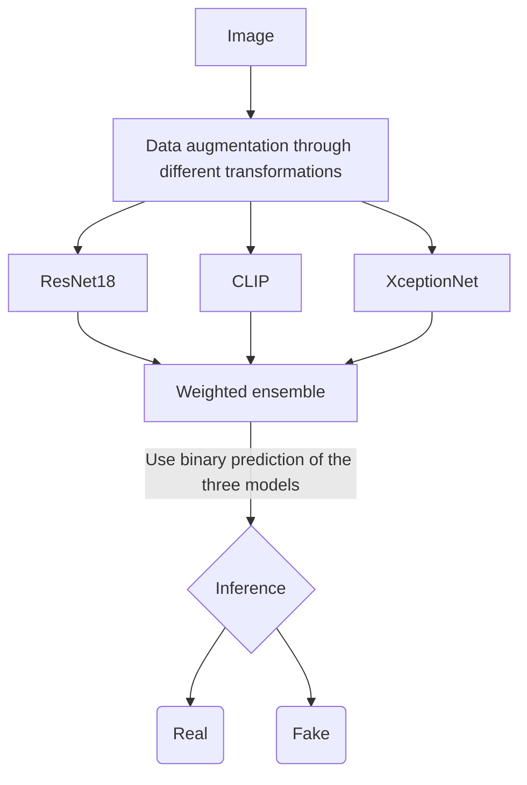

# DFR3Net - Deep Fake Recognition Net

## 🚀 Project Summary

This project presents a robust and highly accurate computer vision system for distinguishing between authentic (real)
and manipulated (deepfake) images. The primary goal is to develop an effective detection tool to mitigate the growing
societal risks associated with deepfakes, such as misinformation and privacy violations.
To address the challenge posed by the diversity of deepfake generation techniques , the system utilizes a weighted
ensemble approach that integrates the predictions of three distinct neural network architectures:

* ResNet-18
* CLIP (Contrastive Language-Image Pretraining)
* XceptionNet combined with Wavelet Transform

By leveraging the complementary strengths of these models, the ensemble achieved a superior accuracy of 94.24% on clean
test images, significantly outperforming individual models.

## 🔑 Key Optimizations and Performance Strategies

Several strategic enhancements were implemented to maximize the system's accuracy, generalization, and robustness
against real-world distortions:

1. **Hybrid Weighted Ensemble Strategy**. The most significant optimization was the adoption of a weighted ensemble over
   simpler methods like majority voting.
    * Weighted Approach: The weighted strategy allows the ensemble to modulate the contribution of each model's
      prediction via
      a learnable weight, effectively prioritizing models with higher reliability for a given input.

2. **Frequency Domain Feature Extraction**. The Wavelet Transform was integrated as a preprocessing step for the
   XceptionNet model.
    * Implementation: A single-level 2D Discrete Wavelet Transform (2D-DWT) using Haar wavelets was applied to generate
      four
      coefficient matrices (approximate and three detail coefficients). These four channels were concatenated with the
      original RGB channels, resulting in a 12-channel input for a modified XceptionNet, allowing the network to
      leverage both
      spatial and frequency information.

3. **Complementary Model Architectures**. Three fundamentally different architectures were chosen to capture diverse
   artifacts:

    * ResNet-18: Selected for its computational efficiency and use of residual connections for stable optimization,
      initialized with pre-trained weights for faster convergence.
    * CLIP (Transformer-based): Used as a feature extractor to generate 512-dimensional embeddings that capture
      high-level
      semantic patterns in addition to low-level visual cues. This makes the representations robust to distribution
      shifts.
    * XceptionNet: Chosen for its use of depthwise separable convolutions, which significantly reduce parameters while
      maintaining strong representational capacity, focusing on spatial and cross-channel correlations.

4. **Robust Data Augmentation Strategy**. To enhance the model's generalization ability and robustness in real-world
   conditions, a stochastic data augmentation
   strategy was applied during training.
    * Transformations: At each training step, one of four transformations was applied with a uniform 25% probability:
      Contrast
      adjustment, Blurring, Gaussian noise injection, or No transformation (identity).
    * Benefit: This simulated common artifacts and distortions (e.g., variations in illumination, compression artifacts,
      sensor noise), ensuring the model is exposed to a broader distribution of visual patterns and perturbations.

## 🔧 DFR3Net pipeline

The overall system can be sumup with this pipeline

## 🏅 Results

The core finding of the evaluation is that while individual models (ResNet-18, CLIP, XceptionNet) show strong
performance on clean data, they lack robustness against real-world image distortions. Simple combination methods, like
majority voting, proved ineffective. The weighted ensemble emerged as the superior strategy, demonstrating improved
generalization and stability by outperforming all individual base models under both clean and distorted conditions. This
success is attributed to its ability to assign adaptive weights and effectively fuse the complementary feature
representations learned by the diverse architectures, as visually confirmed by t-SNE and Grad-CAM analyses. The study
concludes that combining models with different perspectives is crucial for building a more reliable deepfake detection
system.

 **Model**   | **Accuracy** (%) | **Accuracy (%) with TR** 
:------------|:----------------:|:------------------------:
 Ensemble    |      94,14       |          86,82           
 XceptionNet |      91,37       |          84,18           
 CLIP        |      90,72       |          78,81           
 ResNet18    |      88,57       |          82,13           

## 🐦‍🔥 Conclusion

This work addressed the challenge of deepfake detection by introducing a hybrid multi-architecture ensemble that
leverages the complementary strengths of ResNet-18, CLIP, and XceptionNet with Wavelet Transform. The key finding is
that a weighted ensemble strategy achieved superior accuracy ($\text{94.14}\%$) over all individual models, confirming
that combining diverse architectures creates a more robust and generalizable detection system. Unlike simple majority
voting, the weighted approach effectively prioritizes reliable predictions. Future research will focus on extending this
smart combination strategy to video deepfake detection and exploring advanced fusion techniques to combat
misinformation.